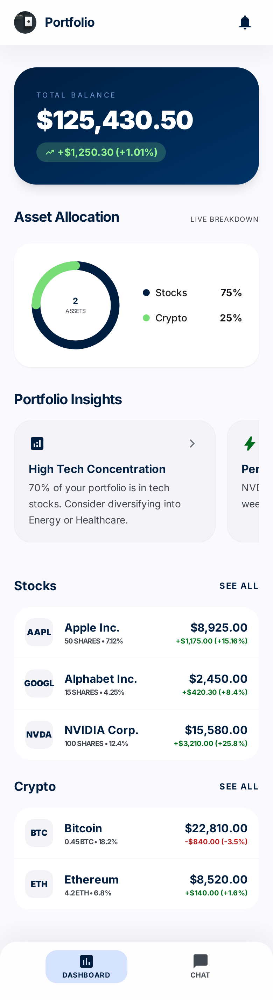
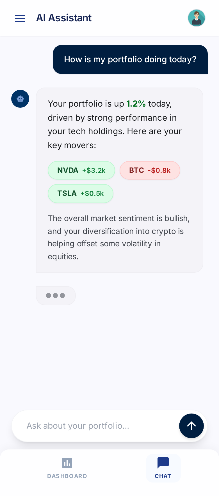
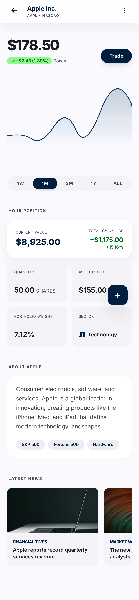

# Technical Spec: AI Portfolio Companion

## Screen Designs

Reference mockups for each screen (generated via Google Stitch). These mockups are **visual guidance** — they show how the app can look, not how it must look. The specs (`requirements.md`, `technical-spec.md`, `design-system.md`, `mobile-app-spec.md`) are the source of truth for features, scope, and design tokens. If a mockup shows a feature not in the specs (e.g., "Trade" button, "Latest News" section, tags), it is out of scope. If the specs require something not visible in the mockups, the specs win. Design token values (colors, typography, spacing) come from `design-system.md`, not from the mockup pixel values.

| Screen | Mockup |
|--------|--------|
| Portfolio Dashboard |  |
| AI Chat |  |
| Holding Detail |  |

## Architecture Overview

Monorepo with two main packages:

```
/
├── frontend/       # Angular 21 / Ionic 8 / Capacitor 8
├── backend/        # Node.js / Express / TypeScript
└── specs/
```

Frontend communicates with backend via REST + streaming (fetch + ReadableStream).
Backend generates all mock data deterministically via seeded PRNG.
Backend proxies AI requests to a configurable OpenAI-compatible endpoint.

## Frontend Architecture

### Stack
- Angular 21 (standalone components, signals)
- Ionic 8 (mobile UI components) — verify `@ionic/angular` peer dependency supports Angular 21; Ionic 8.8 is the final minor release before Ionic 9, and Angular 21 compatibility is not yet confirmed in official docs. If peer deps conflict, pin Angular 20.
- Capacitor 8 (native deployment)
- TypeScript strict mode
- Chart.js (via ng2-charts 10) — donut chart
- lightweight-charts 5 (TradingView) — price history chart
- ngx-markdown 21 — chat markdown rendering. Note: v21 has a breaking change — `MarkdownModuleConfig.sanitize` no longer accepts `SecurityContext`; use the `SANITIZE` injection token instead. Configure sanitization to prevent XSS from LLM-generated markdown.

### Navigation
- Two bottom tabs: Dashboard, Chat (Ionic tabs)
- Holding Detail — shared route accessible from both tabs (not tied to a single tab stack)
- Insight card tap — switches to Chat tab and pre-fills the input (does not auto-send, does not clear history)

### Component Structure
```
app/
├── tabs/
│   ├── dashboard/
│   │   ├── dashboard.page.ts          # Dashboard tab page
│   │   ├── portfolio-summary/         # Total value, daily change
│   │   ├── allocation-chart/          # Donut chart by asset type
│   │   ├── insight-cards/             # Horizontal scroll row
│   │   └── holdings-list/             # Grouped list (stocks, crypto)
│   └── chat/
│       ├── chat.page.ts               # Chat tab page
│       ├── message-list/              # Scrollable message list
│       ├── message-bubble/            # Single message (markdown + holding links)
│       └── chat-input/                # Text input + send button
├── pages/
│   └── holding-detail/
│       ├── holding-detail.page.ts     # Detail page (shared route)
│       ├── price-chart/               # TradingView lightweight chart
│       └── position-summary/          # Position stats
├── services/
│   ├── portfolio.service.ts           # Portfolio + holdings API calls
│   ├── insights.service.ts            # Insight cards API calls
│   ├── chat.service.ts                # Chat API calls + streaming
│   └── api.service.ts                 # Base HTTP client config (API_BASE_URL)
├── models/
│   ├── portfolio.model.ts
│   ├── holding.model.ts
│   ├── insight.model.ts
│   └── chat.model.ts
└── components/
    └── holding-link/
        └── holding-link.component.ts  # Renders [HOLDING:TICKER] as tappable chip
```

### State Management
- Angular Signals for component state
- Services hold reactive state via signals
- Chat streaming state signal: `idle | thinking | streaming | error`
- No external state management library (overkill for this scope)

### Streaming Implementation
- Chat service uses `fetch` with `ReadableStream` to consume POST-based streaming responses
- `EventSource` is NOT used (it only supports GET)
- Tokens appended to a signal as they arrive
- Thinking indicator shown while state is `thinking` (before first token)
- State transitions (happy path): `idle → thinking → streaming → idle`
- State transitions (error): `idle → thinking → error` (failure before first token) or `idle → thinking → streaming → error` (failure mid-stream)
- Recovery: `error → idle` (user dismisses error or taps retry)

### Holding Link Rendering
- System prompt instructs LLM to use `[HOLDING:TICKER]` when referencing portfolio assets
- During streaming: render all text as plain markdown
- After each chunk: run regex on the accumulated text to detect completed `[HOLDING:TICKER]` patterns
- Confirmed patterns are rendered as `holding-link` components (Ionic chip with ticker, tappable → navigates to `/holding/:ticker`)
- Unconfirmed partial patterns (e.g., `[HOLD...` at the end of stream) are left as plain text until resolved by next chunk or stream completion
- A pipe cannot create interactive Angular components — use a custom component that splits text by the `[HOLDING:TICKER]` regex and iterates over segments with `@for`, rendering text via `ngx-markdown` and tickers as `holding-link` components

### API Base URL Configuration
- `API_BASE_URL` configured via Angular environment files
- Default: `http://localhost:3000` for local development
- For device testing: set to `http://<LAN-IP>:3000`
- Can be overridden at build time or via Capacitor runtime config

## Backend Architecture

### Stack
- Node.js + Express
- TypeScript
- better-sqlite3 (chat persistence) — native C++ addon; requires Vitest config for ESM interop (e.g., `deps.interopDefault` or `deps.inline`)
- seedrandom (deterministic mock data)
- OpenAI-compatible API client for AI proxy

### Project Structure
```
backend/
├── src/
│   ├── index.ts                  # Express app entry point
│   ├── routes/
│   │   ├── portfolio.routes.ts   # GET /api/portfolio
│   │   ├── holdings.routes.ts    # GET /api/holdings/:ticker, /api/holdings/:ticker/history
│   │   ├── insights.routes.ts    # GET /api/insights
│   │   └── chat.routes.ts        # GET /api/chat/messages, POST /api/chat/messages
│   ├── services/
│   │   ├── portfolio.service.ts  # Portfolio data generation
│   │   ├── holdings.service.ts   # Holdings + price history generation
│   │   ├── insights.service.ts   # Portfolio-aware insight cards
│   │   ├── chat.service.ts       # Chat persistence + AI proxy
│   │   └── ai.service.ts         # OpenAI-compatible API client
│   ├── data/
│   │   └── generator.ts          # Seeded PRNG data generation
│   ├── db/
│   │   └── sqlite.ts             # better-sqlite3 setup + schema
│   └── models/
│       ├── portfolio.model.ts
│       ├── holding.model.ts
│       ├── insight.model.ts
│       └── chat.model.ts
└── package.json
```

### Data Generation (Seeded PRNG)
- Base seed constant in `generator.ts`, combined with current date (YYYY-MM-DD) to produce a daily seed
- The generator accepts an optional `seed` override parameter (and optional `date` override) to support deterministic testing with a fixed test seed
- This ensures data is deterministic within a calendar day but "moves" naturally day-to-day
- Generates a portfolio with ~8-12 holdings (mix of stocks and crypto)
- Each holding: name, ticker, type (`stock` | `crypto`), sector, description, quantity, avgBuyPrice, currentPrice
- Current prices derived from base price + seeded random variance
- Historical prices: generate daily data points working backwards from current price using random walk with seeded PRNG
- Daily change calculated from previous close (also deterministic via same seed)
- "All" range = 5 years of daily data

### Ticker Normalization
- All API routes that accept a ticker parameter are **case-insensitive** (`/api/holdings/aapl` and `/api/holdings/AAPL` return the same result)
- Responses always return **uppercase** tickers
- Tickers consist of 1–5 uppercase ASCII letters (no dots, no hyphens)

### Mock Portfolio Assets (examples)
**Stocks:** AAPL, GOOGL, MSFT, TSLA, AMZN, NVDA
**Crypto:** BTC, ETH, SOL

### SQLite Schema
```sql
CREATE TABLE messages (
    id INTEGER PRIMARY KEY AUTOINCREMENT,
    role TEXT NOT NULL CHECK(role IN ('user', 'assistant')),
    content TEXT NOT NULL,
    created_at DATETIME DEFAULT CURRENT_TIMESTAMP
);
```

Timestamps stored as ISO 8601 UTC strings. Mapped to camelCase `createdAt` in API responses.

### LLM System Prompt

The system prompt is constructed dynamically on each request by injecting current portfolio data:

```
You are a helpful portfolio assistant for an investment tracking app.

The user's current portfolio:
{{serialized holdings with current values, gains, allocations}}

Rules:
- When referencing a specific holding from the portfolio, always use the format [HOLDING:TICKER] (e.g., [HOLDING:AAPL], [HOLDING:BTC]).
- Provide concise, actionable financial insights.
- You are not a financial advisor — always note that your analysis is informational, not financial advice.
- Reference specific numbers from the portfolio data when relevant.
```

The portfolio data is fetched fresh from the portfolio service on every chat request, ensuring the LLM always has up-to-date context. This is a **Context-Augmented Generation (CAG)** approach — the portfolio data is small enough to fit entirely in the LLM context window, so no vector database or retrieval step is needed.

### Chat Context Management
- On each chat request, backend loads the last `MAX_HISTORY_MESSAGES` (default: 50) messages from SQLite, counted as total messages regardless of role (a mix of user and assistant messages)
- These are sent as conversation history to the LLM along with the system prompt. The current user message is always included even if it would exceed the limit.
- This prevents context overflow while maintaining conversational coherence
- The full history remains in SQLite for the user to scroll through in the UI

### AI Proxy
- Reads config from environment variables (fails fast on startup if `AI_API_URL` or `AI_API_KEY` are missing):
  - `AI_API_URL` — base URL (e.g., `https://api.openai.com/v1`)
  - `AI_API_KEY` — auth token
  - `AI_MODEL` — model name (e.g., `gpt-4o`)
- Calls `POST /chat/completions` with `stream: true`
- System prompt includes portfolio context (current holdings, values)
- System prompt instructs LLM to use `[HOLDING:TICKER]` format when referencing assets
- Streams response chunks from provider → chunked transfer encoding to frontend
- User message is stored in SQLite immediately before calling the LLM
- Assistant message is stored in SQLite after streaming completes (final accumulated content)

### Streaming Response Format

The POST endpoint uses chunked transfer encoding with `Content-Type: text/event-stream`. Each event is an SSE-formatted line followed by a blank line (`\n\n` separator, per the SSE spec):

```
data: {"content": "Your"}\n
\n
data: {"content": " portfolio"}\n
\n
data: [DONE]\n
\n
```

- The `content` field is a **delta** (the new token), not the accumulated text
- Each `data:` line contains a single-line JSON object (no multi-line JSON)
- Events are separated by `\n\n` (standard SSE framing)
- No `event:` or `id:` fields are used
- Chunk boundaries from the transport layer may split mid-event; the client must buffer incomplete lines

This matches the OpenAI streaming format convention, making the client-side parsing straightforward.

### Streaming Error Recovery

If the upstream LLM stream fails mid-response:
- **Backend:** The partial assistant message is **discarded** (not saved to SQLite). The response stream is closed. The client detects the incomplete stream (no `[DONE]` received).
- **Frontend:** Chat state transitions to `error`. Partial streamed text is cleared. An error message is shown with a retry option. The user's original message remains in SQLite and the UI.

### CORS
Allowed origins: `http://localhost:4200` (Angular dev server), `capacitor://localhost` (iOS Capacitor), `http://localhost` (Android Capacitor). An optional `CORS_ORIGIN` env var adds additional origins.

### Environment Variables
```
PORT=3000
AI_API_URL=https://api.openai.com/v1
AI_API_KEY=sk-...
AI_MODEL=gpt-4o
MAX_HISTORY_MESSAGES=50
CORS_ORIGIN=                # optional additional origin
```

## API Contracts

### GET /api/portfolio
Response:
```json
{
  "totalValue": 125430.50,
  "dailyChange": 1250.30,
  "dailyChangePercent": 1.01,
  "holdings": [
    {
      "ticker": "AAPL",
      "name": "Apple Inc.",
      "type": "stock",
      "quantity": 50,
      "currentPrice": 178.50,
      "currentValue": 8925.00,
      "avgBuyPrice": 155.00,
      "gainLoss": 1175.00,
      "gainLossPercent": 15.16,
      "portfolioPercent": 7.12
    }
  ]
}
```

### GET /api/holdings/:ticker
Returns additional detail not present in the portfolio list.
Response:
```json
{
  "ticker": "AAPL",
  "name": "Apple Inc.",
  "type": "stock",
  "sector": "Technology",
  "description": "Consumer electronics, software, and services",
  "quantity": 50,
  "currentPrice": 178.50,
  "currentValue": 8925.00,
  "avgBuyPrice": 155.00,
  "gainLoss": 1175.00,
  "gainLossPercent": 15.16,
  "portfolioPercent": 7.12
}
```

### GET /api/holdings/:ticker/history?range=1M
Valid ranges: `1W`, `1M`, `3M`, `1Y`, `All` (5 years). Range matching is **case-insensitive** (e.g., `all`, `ALL`, and `All` are equivalent). Invalid ranges return 400 Bad Request.
Response:
```json
{
  "ticker": "AAPL",
  "range": "1M",
  "data": [
    { "date": "2026-03-01", "price": 172.30 },
    { "date": "2026-03-02", "price": 173.10 }
  ]
}
```

### GET /api/insights
Response:
```json
{
  "insights": [
    {
      "id": "tech-concentration",
      "title": "High Tech Concentration",
      "summary": "70% of your portfolio is in tech stocks",
      "prompt": "Analyze my tech sector exposure and suggest diversification options"
    }
  ]
}
```

### GET /api/chat/messages
Response:
```json
{
  "messages": [
    {
      "id": 1,
      "role": "user",
      "content": "How is my portfolio doing?",
      "createdAt": "2026-03-31T10:00:00Z"
    },
    {
      "id": 2,
      "role": "assistant",
      "content": "Your portfolio is up 1.01% today...",
      "createdAt": "2026-03-31T10:00:05Z"
    }
  ]
}
```

### POST /api/chat/messages
Request:
```json
{
  "content": "How is my portfolio doing?"
}
```
Validation: `content` must be a non-empty string. Returns 400 Bad Request if missing, empty, or wrong type.

Response: Chunked transfer encoding with SSE-formatted lines (see Streaming Response Format above).

## Key Design Decisions

| Decision | Choice | Rationale |
|---|---|---|
| State management | Angular Signals | Lightweight, built-in, sufficient for this scope |
| Charts | Chart.js + lightweight-charts | Donut chart + financial-grade price charts |
| Chat persistence | Backend SQLite | Persists across app restarts on the same backend instance |
| AI provider | OpenAI-compatible configurable | Works with any compatible provider, no lock-in |
| Streaming | fetch + ReadableStream | POST-based streaming; EventSource only supports GET |
| Mock data | Seeded PRNG (date-based) | Deterministic within a day, natural daily movement |
| Monorepo | Single repo | Simpler for assessment, shared types possible |
| AI context | CAG (Context-Augmented Generation) | Portfolio data small enough for direct context injection |
| Holding ID | Ticker as canonical ID | Simple, human-readable, consistent across LLM output and API |
| Holding links | Post-process regex, not token buffering | Avoids fragile bracket buffering during streaming |
| Holding detail route | Shared route (not tab-specific) | Accessible from both Dashboard and Chat tabs |

## Future Considerations (documented, not implemented)

- **Rolling summarization** for unlimited conversation length — see https://dev.to/nesquikm/how-i-fit-50-turn-stories-into-6k-tokens-1pe
- **WebSocket support** for proactive server-initiated conversations (higher BE load)
- **PowerSync** for offline-first with client-server SQLite sync
- **RAG with embeddings** — as user data grows (transaction history, market news, research notes), portfolio context will exceed LLM context window limits. At that point, migrate from CAG to proper RAG: embed documents into a vector database, retrieve relevant chunks per query, and inject only the most relevant context. This enables scaling to large portfolios with rich historical data.
